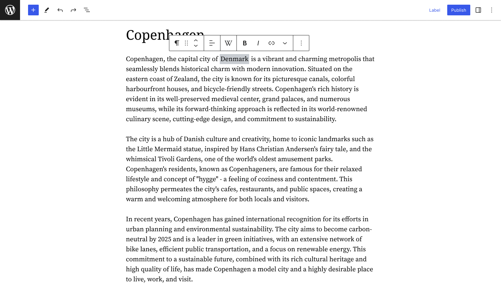

# Wikipedia Preview Wordpress plugin
This WordPress plugin is a thin wrapper around [Wikipedia Preview](https://github.com/wikimedia/wikipedia-preview) to simplify its integration and usage within WordPress. It is available to download as a plugin to your Wordpress site: https://wordpress.org/plugins/wikipedia-preview/ . It provides an interface to add Wikipedia Preview links to your content right from within the Wordpress editor. 


## Dev local setup

Recommended local set up is to:

* use Local https://localwp.com/ to create your testing Wordpress site
* `git clone` this repo into the following path of your Local Sites directory: `/Users/username/Local Sites/sitename/app/public/wp-content/plugins/`
* and then run the following npm commands from cloned directory. 

```bash
$ `npm install`
$ `npm run build`
$ `npm run start`
```

This should load all plugin functionality including the [Wikipedia Preview](https://github.com/wikimedia/wikipedia-preview) code. At this point you should be able to see the plugin in your Wordpress admin dashboard, under the "Plugins" tab. You must activate the plugin from here to be able to see it in your site. 





### Adding custom CSS

You can tweak the styling in your site directly from your Wordpress admin dashboard: go to “Appearance / customize”, then select the “Additional CSS” option from the left side menu. In the text box, the following CSS should reset the existing term style so you can adjust it to your liking.

```CSS
.wmf-wp-with-preview {
    border: 0;
    background-color: unset;
    padding: unset;
}
.wmf-wp-with-preview::after {
    content: '';
}
```
